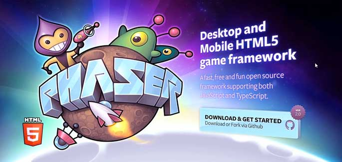

what follows is an introduction to a 'hello world' html5 game with phaser.js.

here briefly a hacker's statement providing some explanation as to why's and wherefore's:

- making use of tools and practices in ways they weren't intended to be used and
- keeping in mind [it's all for the lulz](http://codepen.io/rafszul/pen/bNxwBx/)

as previously mentioned this hello-world app brings together awesome html5 game dev framework phaser.js
 by means of step by step follow up to

's informative and casual 

published by 

plus some ideas remixed already   personal circumstances and insanely twisted experiences of the edge of reality provided by  plus dash of

more fringe experimentation with web tech in this case [svg specification]()

[read about the game](/_arch/_gitHub/_weAreThePlayMakers/the-nice-defender/basic-rules.md) or jump straight in

